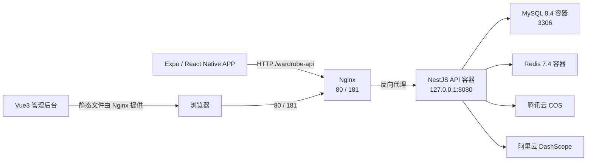

# 衣橱管家部署与运维手册

本文档对应当前项目：

- 项目根目录：`/Users/sxunt/Downloads/expo/wardrobe`
- APP：`/Users/sxunt/Downloads/expo/wardrobe/app`
- NestJS API：`/Users/sxunt/Downloads/expo/wardrobe/api/server`
- Vue3 管理后台：`/Users/sxunt/Downloads/expo/wardrobe/api/admin-vue3`
- 部署配置：`/Users/sxunt/Downloads/expo/wardrobe/deploy`
- 服务器：腾讯云轻量应用服务器，Ubuntu 24.04 LTS
- 服务器公网 IP：`139.155.127.129`
- API 地址：`http://139.155.127.129/wardrobe-api`
- Swagger：`http://139.155.127.129/wardrobe-api/swagger-ui/`
- 管理后台：`http://139.155.127.129:181`

> 本文不记录真实密码、JWT 密钥、腾讯云 COS 密钥或阿里云 DashScope Key。
> 所有敏感值只放在本机被 Git 忽略的环境文件和服务器 `/data/wardrobe/api/.env` 中。

## 1. 当前部署架构



### 1.1 服务器目录

```text
/data/wardrobe/
├── api/                         # 后端源码、Dockerfile、Compose、服务器 .env
├── admin/
│   └── dist.tgz                 # 最近一次上传的后台构建包
└── backups/                     # MySQL 压缩备份

/var/www/wardrobe-admin/         # 管理后台实际静态文件

/etc/nginx/sites-available/
├── wardrobe-api                 # 80 端口 API 代理
└── wardrobe-admin               # 181 端口后台站点
```

### 1.2 端口规划

| 端口 | 用途 | 绑定方式 | 是否需要腾讯云防火墙 |
|---|---|---|---|
| 22 | SSH | 公网 | 是 |
| 80 | API | 公网 Nginx | 是 |
| 181 | 管理后台 | 公网 Nginx | 是 |
| 3306 | MySQL | 公网 Docker 映射 | 仅允许可信 IP |
| 8080 | NestJS | `127.0.0.1` | 否，禁止公网 |
| 6379 | Redis | Docker 内网 | 否，禁止公网 |

### 1.3 当前容器

```bash
cd /data/wardrobe/api
docker compose ps
```

预期包含：

```text
api-api-1
api-mysql-1
api-redis-1
```

## 2. 本机准备

以下命令均在开发电脑执行。

### 2.1 检查基础工具

```bash
node --version
npm --version
git --version
ssh -V
docker --version
```

APP 使用 Expo SDK 54，建议 Node.js 20。

### 2.2 进入项目

```bash
cd /Users/sxunt/Downloads/expo/wardrobe
```

### 2.3 SSH 配置

复制模板：

```bash
cp deploy/server.env.example deploy/server.env
```

编辑：

```bash
nano deploy/server.env
```

密码登录示例：

```env
SSH_HOST=139.155.127.129
SSH_PORT=22
SSH_USER=root
SSH_AUTH_METHOD=password
SSH_PASSWORD=服务器登录密码
SSH_PRIVATE_KEY=
REMOTE_PROJECT_DIR=/data/wardrobe
API_DOMAIN=
SSL_EMAIL=
SERVER_OS=ubuntu
```

私钥登录示例：

```env
SSH_HOST=139.155.127.129
SSH_PORT=22
SSH_USER=root
SSH_AUTH_METHOD=private_key
SSH_PASSWORD=
SSH_PRIVATE_KEY=/Users/你的用户名/.ssh/tencent_lighthouse
REMOTE_PROJECT_DIR=/data/wardrobe
API_DOMAIN=
SSL_EMAIL=
SERVER_OS=ubuntu
```

设置权限：

```bash
chmod 600 deploy/server.env
```

测试连接：

```bash
source deploy/server.env
ssh -p "$SSH_PORT" "$SSH_USER@$SSH_HOST"
```

退出服务器：

```bash
exit
```

### 2.4 密码 SSH 的非交互命令

项目现有 `deploy/.ssh/askpass.sh` 时，可执行：

```bash
cd /Users/sxunt/Downloads/expo/wardrobe
set -a
. deploy/server.env
set +a

export SSH_PASSWORD
export SSH_ASKPASS="$PWD/deploy/.ssh/askpass.sh"
export SSH_ASKPASS_REQUIRE=force
export DISPLAY=dummy

ssh -T \
  -o UserKnownHostsFile=deploy/.ssh/known_hosts \
  -o StrictHostKeyChecking=yes \
  -o PreferredAuthentications=password \
  -o PubkeyAuthentication=no \
  -p "$SSH_PORT" \
  "$SSH_USER@$SSH_HOST" \
  "hostname && uptime" </dev/null
```

日常手工操作使用普通 `ssh` 即可，不必强制使用该方式。

## 3. 腾讯云防火墙

进入腾讯云轻量应用服务器控制台，打开实例的“防火墙”页面。

建议规则：

| 协议 | 端口 | 来源 |
|---|---|---|
| TCP | 22 | 自己的公网 IP，或临时 `0.0.0.0/0` |
| TCP | 80 | `0.0.0.0/0` |
| TCP | 181 | 管理人员公网 IP，测试期可临时开放 |
| TCP | 3306 | 自己的公网 IP `/32` |

不要将 MySQL 3306 设置为：

```text
0.0.0.0/0
```

查看本机公网 IP：

```bash
curl -4 https://ifconfig.me/ip
```

当前配置过的 MySQL 白名单 IP：

```text
171.214.202.200/32
```

公网 IP 变化后，需要同时修改腾讯云防火墙和服务器 `iptables`。

## 4. 新服务器初始化

本节只用于新服务器首次部署。当前服务器已经完成。

### 4.1 登录服务器

```bash
ssh root@139.155.127.129
```

### 4.2 更新系统

```bash
apt-get update
apt-get upgrade -y
```

### 4.3 安装基础软件

```bash
apt-get install -y \
  ca-certificates \
  curl \
  gnupg \
  nginx \
  git \
  unzip \
  gzip \
  tar \
  iptables-persistent
```

### 4.4 安装 Docker Engine

删除可能冲突的旧包：

```bash
for pkg in docker.io docker-doc docker-compose docker-compose-v2 podman-docker containerd runc; do
  apt-get remove -y "$pkg" 2>/dev/null || true
done
```

添加 Docker 官方仓库：

```bash
install -m 0755 -d /etc/apt/keyrings
curl -fsSL https://download.docker.com/linux/ubuntu/gpg \
  -o /etc/apt/keyrings/docker.asc
chmod a+r /etc/apt/keyrings/docker.asc
```

```bash
echo \
  "deb [arch=$(dpkg --print-architecture) signed-by=/etc/apt/keyrings/docker.asc] https://download.docker.com/linux/ubuntu \
  $(. /etc/os-release && echo "$VERSION_CODENAME") stable" \
  > /etc/apt/sources.list.d/docker.list
```

安装：

```bash
apt-get update
apt-get install -y \
  docker-ce \
  docker-ce-cli \
  containerd.io \
  docker-buildx-plugin \
  docker-compose-plugin
```

启动并设置开机启动：

```bash
systemctl enable --now docker
systemctl status docker --no-pager
```

验证：

```bash
docker --version
docker compose version
docker run --rm hello-world
```

### 4.5 启动 Nginx

```bash
systemctl enable --now nginx
nginx -t
systemctl status nginx --no-pager
```

### 4.6 创建目录

```bash
mkdir -p /data/wardrobe/api
mkdir -p /data/wardrobe/admin
mkdir -p /data/wardrobe/backups
mkdir -p /var/www/wardrobe-admin
```

```bash
chown -R root:root /data/wardrobe
chown -R www-data:www-data /var/www/wardrobe-admin
```

## 5. 后端生产环境变量

服务器文件：

```text
/data/wardrobe/api/.env
```

创建：

```bash
cd /data/wardrobe/api
nano .env
```

模板：

```env
NODE_ENV=production
ENABLE_SWAGGER=true

APP_PORT=8080
APP_PREFIX=
APP_DOMAIN=http://139.155.127.129/wardrobe-api
FILE_MAX_SIZE_MB=10

MYSQL_HOST=mysql
MYSQL_PORT=3306
MYSQL_PUBLIC_BIND=0.0.0.0
MYSQL_ROOT_PASSWORD=请填写强密码
MYSQL_USERNAME=wardrobe
MYSQL_PASSWORD=请填写强密码
MYSQL_DATABASE=nest_admin

REDIS_HOST=redis
REDIS_PORT=6379
REDIS_PASSWORD=请填写强密码
REDIS_DB=0

JWT_SECRET=请填写至少32字符随机密钥
JWT_EXPIRES_IN=1h
JWT_REFRESH_EXPIRES_IN=7d

COS_SECRET_ID=请填写腾讯云SecretId
COS_SECRET_KEY=请填写腾讯云SecretKey
COS_BUCKET=axe-video-1257242485
COS_REGION=ap-guangzhou
COS_DOMAIN=请填写COS访问域名
COS_LOCATION=jh_chat/wardrobe

DASHSCOPE_API_KEY=请填写阿里云DashScopeKey
DASHSCOPE_MODEL=qwen-plus
DASHSCOPE_VISUAL_MODEL=qwen-vl-plus
DASHSCOPE_TRY_ON_MODEL=aitryon-plus
AI_ALLOW_FALLBACK=false

RATE_LIMIT_GLOBAL_MAX=1000
RATE_LIMIT_LOGIN_MAX=10
RATE_LIMIT_UPLOAD_MAX=20
RATE_LIMIT_AI_MAX=8
```

生成随机密码：

```bash
openssl rand -base64 32
```

生成 JWT 密钥：

```bash
openssl rand -hex 64
```

保护环境文件：

```bash
chmod 600 /data/wardrobe/api/.env
```

检查变量是否存在，但不要打印真实值：

```bash
cd /data/wardrobe/api
set -a
. ./.env
set +a

for name in \
  MYSQL_ROOT_PASSWORD \
  MYSQL_PASSWORD \
  REDIS_PASSWORD \
  JWT_SECRET \
  COS_SECRET_ID \
  COS_SECRET_KEY \
  DASHSCOPE_API_KEY
do
  eval "value=\${$name:-}"
  if [ -n "$value" ]; then
    echo "$name=SET"
  else
    echo "$name=MISSING"
  fi
done
```

## 6. 首次部署后端

### 6.1 本机检查后端

```bash
cd /Users/sxunt/Downloads/expo/wardrobe/api/server
npm install
npm run build
npm test
```

查看 migration：

```bash
npm run migration:show
```

### 6.2 本机打包后端源码

`.env` 必须排除：

```bash
cd /Users/sxunt/Downloads/expo/wardrobe/api/server
```

```bash
tar \
  --exclude='./node_modules' \
  --exclude='./dist' \
  --exclude='./coverage' \
  --exclude='./.git' \
  --exclude='./.env' \
  --exclude='./logs' \
  --exclude='./upload' \
  --exclude='./ormlogs.log' \
  --exclude='./.DS_Store' \
  -czf /tmp/wardrobe-api.tgz .
```

检查包：

```bash
ls -lh /tmp/wardrobe-api.tgz
tar -tzf /tmp/wardrobe-api.tgz | head -50
```

确认包内没有 `.env`：

```bash
if tar -tzf /tmp/wardrobe-api.tgz | grep -q '^\./\.env$'; then
  echo "错误：压缩包包含 .env"
  exit 1
else
  echo "OK：压缩包不包含 .env"
fi
```

### 6.3 上传

```bash
scp -P 22 \
  /tmp/wardrobe-api.tgz \
  root@139.155.127.129:/tmp/wardrobe-api.tgz
```

### 6.4 服务器解压

```bash
ssh root@139.155.127.129
```

```bash
mkdir -p /data/wardrobe/api
tar -xzf /tmp/wardrobe-api.tgz -C /data/wardrobe/api
cd /data/wardrobe/api
```

确认 `.env`：

```bash
test -f .env && echo ".env exists" || echo ".env missing"
chmod 600 .env
```

### 6.5 构建并启动

```bash
cd /data/wardrobe/api
docker compose build api
docker compose up -d
```

查看状态：

```bash
docker compose ps
```

持续查看日志：

```bash
docker compose logs -f api
```

只看最后 200 行：

```bash
docker compose logs --tail=200 api
```

退出持续日志：

```text
Ctrl+C
```

### 6.6 migration

容器入口 `docker-entrypoint.sh` 会在每次 API 启动时自动执行：

```bash
npm run migration:run:prod
```

然后启动：

```bash
node dist/main
```

手工查看 migration：

```bash
cd /data/wardrobe/api
docker compose exec -T api \
  npx typeorm -d dist/database/data-source.js migration:show
```

手工运行 migration：

```bash
docker compose exec -T api \
  npx typeorm -d dist/database/data-source.js migration:run
```

不建议在生产环境随意回滚 migration。确需回滚时先备份：

```bash
docker compose exec -T api \
  npx typeorm -d dist/database/data-source.js migration:revert
```

## 7. Nginx API 配置

服务器创建：

```bash
nano /etc/nginx/sites-available/wardrobe-api
```

内容：

```nginx
server {
    listen 80;
    listen [::]:80;
    server_name 139.155.127.129;

    root /var/www/html;
    index index.html index.htm index.nginx-debian.html;

    location = /wardrobe-api {
        return 301 /wardrobe-api/;
    }

    location /wardrobe-api/ {
        client_max_body_size 10m;
        proxy_http_version 1.1;
        proxy_pass http://127.0.0.1:8080/;
        proxy_set_header Host $host;
        proxy_set_header X-Real-IP $remote_addr;
        proxy_set_header X-Forwarded-For $proxy_add_x_forwarded_for;
        proxy_set_header X-Forwarded-Proto $scheme;
        proxy_connect_timeout 15s;
        proxy_send_timeout 180s;
        proxy_read_timeout 180s;
    }

    location / {
        try_files $uri $uri/ =404;
    }
}
```

启用：

```bash
ln -sfn \
  /etc/nginx/sites-available/wardrobe-api \
  /etc/nginx/sites-enabled/wardrobe-api
```

检查并重载：

```bash
nginx -t
systemctl reload nginx
```

测试：

```bash
curl -i http://127.0.0.1:8080/captchaImage
curl -i http://139.155.127.129/wardrobe-api/captchaImage
```

Swagger：

```bash
curl -I http://139.155.127.129/wardrobe-api/swagger-ui/
```

浏览器访问：

```text
http://139.155.127.129/wardrobe-api/swagger-ui/
```

## 8. 管理后台部署

### 8.1 生产 API 配置

文件：

```text
api/admin-vue3/.env.production
```

内容：

```env
VITE_APP_TITLE = 衣橱管家管理后台
VITE_APP_ENV = 'production'
VITE_APP_BASE_API = '/wardrobe-api'
VITE_BUILD_COMPRESS = gzip
```

### 8.2 本机构建

```bash
cd /Users/sxunt/Downloads/expo/wardrobe/api/admin-vue3
npm install
npm run build:prod
```

检查产物：

```bash
test -f dist/index.html && echo "build ok"
du -sh dist
```

### 8.3 打包并上传

```bash
tar -czf /tmp/wardrobe-admin.tgz -C dist .
```

```bash
scp -P 22 \
  /tmp/wardrobe-admin.tgz \
  root@139.155.127.129:/data/wardrobe/admin/dist.tgz
```

### 8.4 服务器发布

```bash
ssh root@139.155.127.129
```

```bash
mkdir -p /var/www/wardrobe-admin
rm -rf /var/www/wardrobe-admin/*
tar -xzf /data/wardrobe/admin/dist.tgz \
  -C /var/www/wardrobe-admin
chown -R www-data:www-data /var/www/wardrobe-admin
```

### 8.5 Nginx 后台配置

```bash
nano /etc/nginx/sites-available/wardrobe-admin
```

内容：

```nginx
server {
    listen 181;
    listen [::]:181;
    server_name _;

    root /var/www/wardrobe-admin;
    index index.html;
    client_max_body_size 10m;

    gzip on;
    gzip_vary on;
    gzip_min_length 1024;
    gzip_types text/plain text/css application/json application/javascript application/xml image/svg+xml;

    add_header X-Frame-Options 'SAMEORIGIN' always;
    add_header X-Content-Type-Options 'nosniff' always;
    add_header Referrer-Policy 'strict-origin-when-cross-origin' always;

    location /wardrobe-api/ {
        proxy_http_version 1.1;
        proxy_pass http://127.0.0.1:8080/;
        proxy_set_header Host $host;
        proxy_set_header X-Real-IP $remote_addr;
        proxy_set_header X-Forwarded-For $proxy_add_x_forwarded_for;
        proxy_set_header X-Forwarded-Proto $scheme;
        proxy_connect_timeout 15s;
        proxy_send_timeout 180s;
        proxy_read_timeout 180s;
    }

    location ~* \.(?:js|css|png|jpg|jpeg|gif|svg|ico|woff2?|ttf)$ {
        expires 7d;
        add_header Cache-Control 'public, immutable';
        try_files $uri =404;
    }

    location / {
        try_files $uri $uri/ /index.html;
    }
}
```

启用：

```bash
ln -sfn \
  /etc/nginx/sites-available/wardrobe-admin \
  /etc/nginx/sites-enabled/wardrobe-admin
```

```bash
nginx -t
systemctl reload nginx
```

验证：

```bash
curl -I http://127.0.0.1:181/
curl -I http://139.155.127.129:181/
curl -s http://139.155.127.129:181/ | head
```

## 9. 日常后端发版

每次后端发版按以下顺序。

### 9.1 本机检查

```bash
cd /Users/sxunt/Downloads/expo/wardrobe/api/server
npm run build
npm test
git diff --check
```

### 9.2 先备份数据库

本机上传备份脚本：

```bash
scp -P 22 \
  /Users/sxunt/Downloads/expo/wardrobe/deploy/backup-db.sh \
  root@139.155.127.129:/data/wardrobe/backup-db.sh
```

服务器执行：

```bash
ssh root@139.155.127.129
chmod +x /data/wardrobe/backup-db.sh
/data/wardrobe/backup-db.sh
```

预期输出：

```text
/data/wardrobe/backups/nest_admin_YYYYMMDD_HHMMSS.sql.gz
```

### 9.3 打包上传

```bash
cd /Users/sxunt/Downloads/expo/wardrobe/api/server
```

```bash
tar \
  --exclude='./node_modules' \
  --exclude='./dist' \
  --exclude='./coverage' \
  --exclude='./.git' \
  --exclude='./.env' \
  --exclude='./logs' \
  --exclude='./upload' \
  --exclude='./ormlogs.log' \
  --exclude='./.DS_Store' \
  -czf /tmp/wardrobe-api-release.tgz .
```

```bash
scp -P 22 \
  /tmp/wardrobe-api-release.tgz \
  root@139.155.127.129:/tmp/wardrobe-api-release.tgz
```

### 9.4 服务器更新

```bash
ssh root@139.155.127.129
```

```bash
tar -xzf /tmp/wardrobe-api-release.tgz \
  -C /data/wardrobe/api
```

```bash
cd /data/wardrobe/api
docker compose build api
docker compose up -d api
```

等待健康：

```bash
for i in 1 2 3 4 5 6 7 8; do
  state=$(docker inspect -f '{{.State.Health.Status}}' api-api-1 2>/dev/null || true)
  echo "API health: $state"
  [ "$state" = "healthy" ] && break
  sleep 3
done
```

检查：

```bash
docker compose ps
docker compose logs --tail=100 api
```

公网验证：

```bash
curl -I http://139.155.127.129/wardrobe-api/swagger-ui/
curl -s http://139.155.127.129/wardrobe-api/captchaImage | head -c 200
```

## 10. 日常后台发版

```bash
cd /Users/sxunt/Downloads/expo/wardrobe/api/admin-vue3
npm run build:prod
```

```bash
tar -czf /tmp/wardrobe-admin-release.tgz -C dist .
```

```bash
scp -P 22 \
  /tmp/wardrobe-admin-release.tgz \
  root@139.155.127.129:/data/wardrobe/admin/dist.tgz
```

```bash
ssh root@139.155.127.129
```

```bash
rm -rf /var/www/wardrobe-admin/*
tar -xzf /data/wardrobe/admin/dist.tgz \
  -C /var/www/wardrobe-admin
chown -R www-data:www-data /var/www/wardrobe-admin
nginx -t
systemctl reload nginx
```

验证：

```bash
curl -I http://139.155.127.129:181/
```

浏览器强制刷新：

```text
macOS: Command + Shift + R
Windows: Ctrl + F5
```

## 11. MySQL 连接与白名单

### 11.1 当前公网连接参数

数据库工具填写：

```text
主机：139.155.127.129
端口：3306
用户名：wardrobe
密码：服务器 /data/wardrobe/api/.env 中 MYSQL_PASSWORD
数据库：nest_admin
SSH 隧道：关闭
```

### 11.2 更安全的 SSH 隧道方式

如果不需要公网 3306，将服务器 `.env` 改为：

```env
MYSQL_PUBLIC_BIND=127.0.0.1
```

重建 MySQL 端口映射：

```bash
cd /data/wardrobe/api
docker compose up -d mysql api
```

数据库工具启用 SSH：

```text
SSH 主机：139.155.127.129
SSH 端口：22
SSH 用户：root
MySQL 主机：127.0.0.1
MySQL 端口：3306
MySQL 用户：wardrobe
数据库：nest_admin
```

### 11.3 查看服务器白名单

```bash
iptables -S DOCKER-USER
```

当前规则结构：

```text
允许指定 IP 访问 3306
拒绝其他来源访问 3306
```

### 11.4 更换白名单 IP

查询新 IP：

```bash
curl -4 https://ifconfig.me/ip
```

删除旧 IP：

```bash
iptables -D DOCKER-USER \
  -s 171.214.202.200/32 \
  -p tcp \
  --dport 3306 \
  -j ACCEPT
```

添加新 IP，示例 `1.2.3.4`：

```bash
iptables -I DOCKER-USER 1 \
  -s 1.2.3.4/32 \
  -p tcp \
  --dport 3306 \
  -j ACCEPT
```

确认兜底拒绝规则存在：

```bash
iptables -C DOCKER-USER \
  -p tcp \
  --dport 3306 \
  -j DROP \
  || iptables -A DOCKER-USER \
    -p tcp \
    --dport 3306 \
    -j DROP
```

保存规则：

```bash
netfilter-persistent save
systemctl enable netfilter-persistent
systemctl restart netfilter-persistent
```

验证：

```bash
systemctl is-enabled netfilter-persistent
systemctl is-active netfilter-persistent
iptables -S DOCKER-USER
```

还需要同步修改腾讯云轻量服务器防火墙中的 3306 来源 IP。

### 11.5 本机测试端口

```bash
nc -vz -w 5 139.155.127.129 3306
```

### 11.6 容器内连接 MySQL

```bash
ssh root@139.155.127.129
cd /data/wardrobe/api
set -a
. ./.env
set +a
```

业务账号：

```bash
docker compose exec mysql \
  mysql \
  -u"$MYSQL_USERNAME" \
  -p"$MYSQL_PASSWORD" \
  "$MYSQL_DATABASE"
```

Root：

```bash
docker compose exec mysql \
  mysql \
  -uroot \
  -p"$MYSQL_ROOT_PASSWORD"
```

退出 MySQL：

```sql
exit;
```

## 12. 数据库备份与恢复

### 12.1 手工备份

```bash
ssh root@139.155.127.129
cd /data/wardrobe/api
set -a
. ./.env
set +a
```

```bash
mkdir -p /data/wardrobe/backups
```

```bash
docker compose exec -T mysql \
  mysqldump \
  --single-transaction \
  --quick \
  --lock-tables=false \
  --no-tablespaces \
  -u"$MYSQL_USERNAME" \
  -p"$MYSQL_PASSWORD" \
  "$MYSQL_DATABASE" \
  | gzip \
  > "/data/wardrobe/backups/nest_admin_$(date +%Y%m%d_%H%M%S).sql.gz"
```

```bash
ls -lh /data/wardrobe/backups
```

### 12.2 使用备份脚本

```bash
/data/wardrobe/backup-db.sh
```

脚本默认删除 7 天以前的 `nest_admin_*.sql.gz`。

### 12.3 下载备份到本机

```bash
scp -P 22 \
  root@139.155.127.129:/data/wardrobe/backups/nest_admin_YYYYMMDD_HHMMSS.sql.gz \
  /Users/sxunt/Downloads/
```

### 12.4 恢复前再次备份

```bash
/data/wardrobe/backup-db.sh
```

### 12.5 恢复数据库

谨慎执行，恢复会修改线上数据：

```bash
cd /data/wardrobe/api
set -a
. ./.env
set +a
```

```bash
gunzip -c /data/wardrobe/backups/要恢复的文件.sql.gz \
  | docker compose exec -T mysql \
    mysql \
    -u"$MYSQL_USERNAME" \
    -p"$MYSQL_PASSWORD" \
    "$MYSQL_DATABASE"
```

恢复后：

```bash
docker compose restart api
docker compose logs --tail=100 api
```

## 13. Redis 运维

Redis 未映射到公网。

连接：

```bash
ssh root@139.155.127.129
cd /data/wardrobe/api
set -a
. ./.env
set +a
```

```bash
docker compose exec redis \
  redis-cli -a "$REDIS_PASSWORD"
```

测试：

```redis
PING
```

查看键数量：

```redis
DBSIZE
```

查看登录令牌：

```redis
SCAN 0 MATCH login_tokens:* COUNT 100
```

退出：

```redis
QUIT
```

不要在生产环境随意执行：

```redis
FLUSHALL
```

## 14. Android APK 构建

### 14.1 APP 配置

文件：

```text
app/app.json
```

关键配置：

```json
{
  "expo": {
    "name": "衣橱管家",
    "slug": "wardrobe-manager",
    "version": "1.0.0",
    "android": {
      "package": "com.if43vip.wardrobemanager",
      "versionCode": 1
    }
  }
}
```

EAS：

```text
app/eas.json
```

Preview APK 使用：

```json
{
  "build": {
    "preview": {
      "distribution": "internal",
      "android": {
        "buildType": "apk"
      },
      "env": {
        "EXPO_PUBLIC_API_BASE_URL": "http://139.155.127.129/wardrobe-api"
      }
    }
  }
}
```

### 14.2 本机检查

```bash
cd /Users/sxunt/Downloads/expo/wardrobe/app
npm install
npx expo-doctor
npm run lint
```

查看 Expo 登录账号：

```bash
npx eas-cli whoami
```

登录：

```bash
npx eas-cli login
```

### 14.3 构建测试 APK

```bash
npx eas-cli build \
  --platform android \
  --profile preview \
  --non-interactive \
  --wait
```

不等待构建：

```bash
npx eas-cli build \
  --platform android \
  --profile preview \
  --non-interactive
```

查看最近构建：

```bash
npx eas-cli build:list \
  --platform android \
  --limit 10
```

查看指定构建：

```bash
npx eas-cli build:view 构建ID
```

JSON：

```bash
npx eas-cli build:view 构建ID --json
```

下载 APK：

```bash
mkdir -p builds
curl -fL \
  -o builds/wardrobe-manager-preview.apk \
  "EAS返回的applicationArchiveUrl"
```

校验：

```bash
ls -lh builds/wardrobe-manager-preview.apk
shasum -a 256 builds/wardrobe-manager-preview.apk
```

### 14.4 版本升级

每次正式构建前修改：

```text
app.json -> expo.version
app.json -> expo.android.versionCode
```

示例：

```json
{
  "version": "1.0.1",
  "android": {
    "versionCode": 2
  }
}
```

`versionCode` 必须递增。

### 14.5 HTTP 注意事项

当前 API 使用 HTTP，Android 配置：

```json
{
  "expo-build-properties": {
    "android": {
      "usesCleartextTraffic": true
    }
  }
}
```

正式上线建议配置域名和 HTTPS，之后关闭明文 HTTP。

## 15. APP 本地联调

### 15.1 本地开发环境

文件：

```text
app/.env
```

示例：

```env
EXPO_PUBLIC_API_BASE_URL=http://192.168.18.105:8080
```

启动：

```bash
cd /Users/sxunt/Downloads/expo/wardrobe/app
npx expo start
```

Web：

```bash
npm run web
```

清缓存：

```bash
npx expo start -c
```

Android 原生开发构建：

```bash
npm run android
```

### 15.2 线上 API 本地测试

临时指定环境变量：

```bash
EXPO_PUBLIC_API_BASE_URL=http://139.155.127.129/wardrobe-api \
  npx expo start -c
```

## 16. 服务启停

### 16.1 查看状态

```bash
ssh root@139.155.127.129
cd /data/wardrobe/api
docker compose ps
```

### 16.2 停止全部容器

```bash
docker compose stop
```

### 16.3 启动全部容器

```bash
docker compose start
```

### 16.4 重启全部容器

```bash
docker compose restart
```

### 16.5 只重启 API

```bash
docker compose restart api
```

### 16.6 停止并删除容器

```bash
docker compose down
```

该命令默认不删除数据卷。

绝对不要随意执行：

```bash
docker compose down -v
```

`-v` 会删除 MySQL 和 Redis 数据卷。

### 16.7 Nginx

```bash
nginx -t
systemctl reload nginx
systemctl restart nginx
systemctl status nginx --no-pager
```

## 17. 日志与故障排查

### 17.1 API 500

```bash
cd /data/wardrobe/api
docker compose logs --since=30m api
```

只看错误：

```bash
docker compose logs --since=30m api 2>&1 \
  | grep -A20 -B5 -E 'ERROR|QueryFailedError|TypeError'
```

### 17.2 MySQL

```bash
docker compose logs --tail=200 mysql
```

检查表字符集：

```bash
set -a
. ./.env
set +a
```

```bash
docker compose exec -T mysql \
  mysql \
  -u"$MYSQL_USERNAME" \
  -p"$MYSQL_PASSWORD" \
  -N \
  -e "
    SELECT TABLE_NAME, TABLE_COLLATION
    FROM information_schema.TABLES
    WHERE TABLE_SCHEMA = '$MYSQL_DATABASE'
    ORDER BY TABLE_NAME;
  "
```

### 17.3 Redis

```bash
docker compose logs --tail=200 redis
```

```bash
docker compose exec -T redis \
  redis-cli -a "$REDIS_PASSWORD" ping
```

预期：

```text
PONG
```

### 17.4 Nginx

```bash
tail -f /var/log/nginx/access.log
tail -f /var/log/nginx/error.log
```

检查配置：

```bash
nginx -t
```

查看实际启用站点：

```bash
ls -la /etc/nginx/sites-enabled
```

### 17.5 端口

```bash
ss -lntp | grep -E ':(22|80|181|3306|8080) '
```

预期：

```text
0.0.0.0:80
0.0.0.0:181
0.0.0.0:3306
127.0.0.1:8080
```

### 17.6 容器资源

```bash
docker stats
```

磁盘：

```bash
df -h
docker system df
```

清理无用构建缓存：

```bash
docker builder prune
```

清理未使用镜像：

```bash
docker image prune
```

不要未经确认执行：

```bash
docker system prune -a --volumes
```

## 18. 回滚

### 18.1 后端镜像回滚原则

当前 Compose 使用本地 `api-api:latest`，每次构建前建议保留旧镜像标签。

发版前：

```bash
cd /data/wardrobe/api
docker image tag api-api:latest \
  "api-api:backup-$(date +%Y%m%d_%H%M%S)"
```

查看：

```bash
docker images api-api
```

回滚时，将指定旧镜像重新标记：

```bash
docker image tag api-api:backup-YYYYMMDD_HHMMSS api-api:latest
docker compose up -d --force-recreate api
```

如果此次发版包含不可逆数据库 migration，代码回滚前必须确认数据库兼容性。

### 18.2 管理后台回滚

发布前备份当前静态文件：

```bash
tar -czf \
  "/data/wardrobe/admin/admin-backup-$(date +%Y%m%d_%H%M%S).tgz" \
  -C /var/www/wardrobe-admin .
```

恢复：

```bash
rm -rf /var/www/wardrobe-admin/*
tar -xzf /data/wardrobe/admin/admin-backup-YYYYMMDD_HHMMSS.tgz \
  -C /var/www/wardrobe-admin
chown -R www-data:www-data /var/www/wardrobe-admin
nginx -t
systemctl reload nginx
```

## 19. 上线后检查清单

### 19.1 后端

```bash
cd /data/wardrobe/api
docker compose ps
docker compose logs --tail=100 api
```

确认：

- API、MySQL、Redis 均为 `healthy`
- migration 没有失败
- 没有连续 500
- Swagger 可以访问

### 19.2 管理后台

浏览器：

```text
http://139.155.127.129:181
```

检查：

- 验证码显示为图片
- 登录成功
- APP 用户列表正常
- 衣物列表正常
- 搭配记录正常
- 新增挑战正常
- 操作日志无 500

### 19.3 APP

检查：

- 注册、登录
- 登录态重启后仍保留
- 拍照、相册权限
- 图片上传到腾讯云 COS
- 图片可以显示
- AI 识别成功和失败提示
- 保存衣物
- 衣橱列表
- 生成搭配
- 搭配历史
- 真人试穿
- 试穿历史
- 定位和天气

## 20. 当前已知安全改进

当前是无域名测试部署，仍建议继续完成：

1. 购买或绑定域名。
2. 使用 HTTPS，开放 443。
3. 将 API 从 HTTP 切换到 HTTPS。
4. 将管理后台 181 限制为管理员 IP，或放到 HTTPS 域名。
5. 优先关闭公网 MySQL，改用 SSH 隧道。
6. 定期轮换 SSH、MySQL、Redis、JWT、COS 和 DashScope 密钥。
7. 将服务器 SSH 从密码登录切换为私钥。
8. 禁止 Root 密码远程登录，创建独立运维用户。
9. 增加自动数据库备份和异地备份。
10. 增加 API、磁盘、数据库、容器健康监控。

## 21. 常用命令速查

登录：

```bash
ssh root@139.155.127.129
```

容器状态：

```bash
cd /data/wardrobe/api && docker compose ps
```

API 日志：

```bash
cd /data/wardrobe/api && docker compose logs -f api
```

重启 API：

```bash
cd /data/wardrobe/api && docker compose restart api
```

备份数据库：

```bash
/data/wardrobe/backup-db.sh
```

检查 Nginx：

```bash
nginx -t && systemctl reload nginx
```

检查 Swagger：

```bash
curl -I http://139.155.127.129/wardrobe-api/swagger-ui/
```

查看 MySQL 白名单：

```bash
iptables -S DOCKER-USER
```

查看端口：

```bash
ss -lntp | grep -E ':(22|80|181|3306|8080) '
```

构建 APK：

```bash
cd /Users/sxunt/Downloads/expo/wardrobe/app
npx eas-cli build --platform android --profile preview --non-interactive --wait
```
